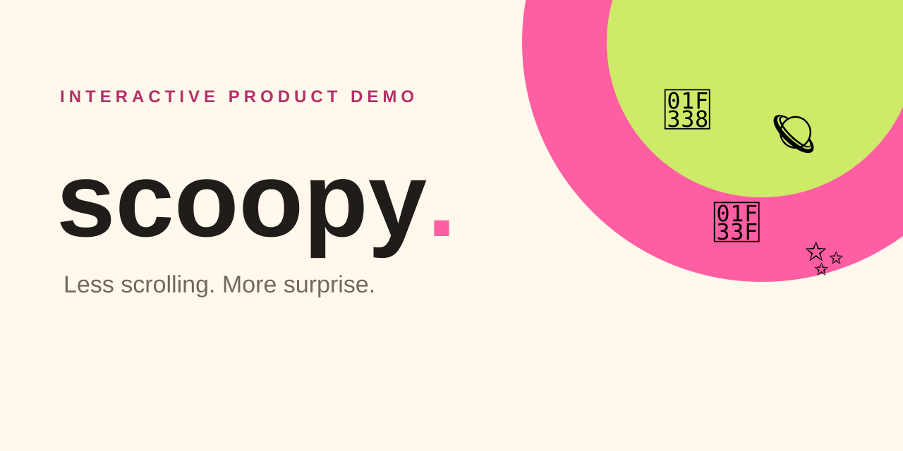

# Scoopy — discover a small wardrobe with a little surprise



**An interactive, privacy-safe product demo that turns a synthetic fashion catalog into a themed scoop.**

[Try the demo](https://caio-felice-cunha.github.io/scoopy-demo/) · [Read the case study](#case-study) · [Run locally](#run-locally)

## What you can test

- Filter a fictional catalog by category, palette, and style.
- Choose a scoop size and a mood, then reveal a deterministic edit.
- Exercise empty states, reset the session, and try the demo-only waitlist.

## Case study

Scoopy explores a product question: can browsing feel less like searching a
warehouse and more like opening a tightly edited box? The original private
prototype established the filter, theme, and “Scoop it!” interaction. This
repository publishes only a clean implementation with synthetic products.

No purchase is possible and the waitlist stores or sends nothing. The design
optimizes for a useful result in under a minute, keyboard use, and clear status
feedback instead of hidden data collection.

## Architecture

```text
Synthetic catalog → visible filters → deterministic scoop → local-only result
```

## Run locally

```bash
npm install
npm run serve
```

Open `http://localhost:4174`. Run `npm run test:all` for unit and browser tests.

## Limitations

- All products and prices are fictional.
- The waitlist is a UI demonstration and never persists an email.
- There is no checkout, inventory, recommendation backend, analytics, or account.

## Security and licensing

Code is MIT licensed. Brand and authored assets have separate rights in
[BRAND-LICENSE.md](./BRAND-LICENSE.md).
